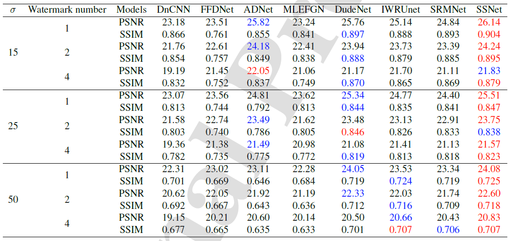
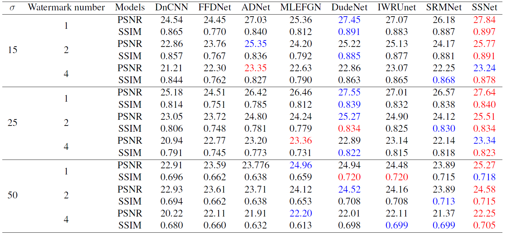
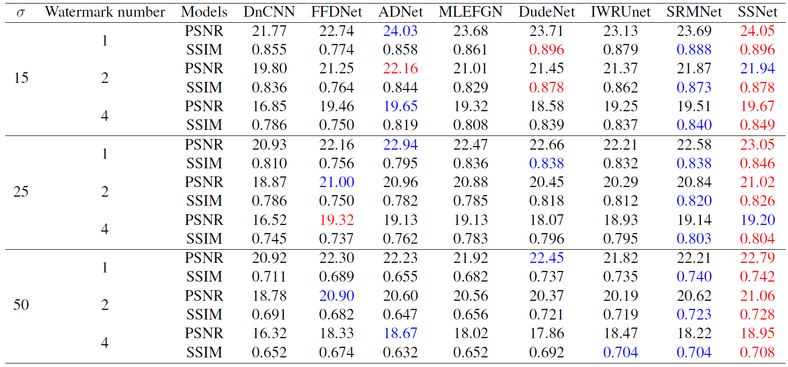
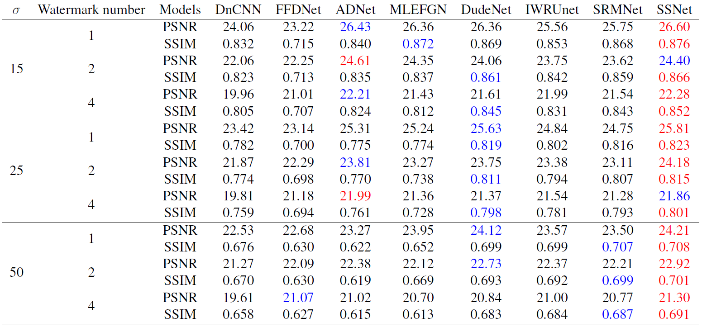
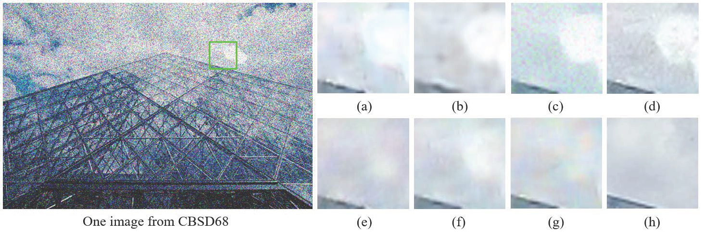
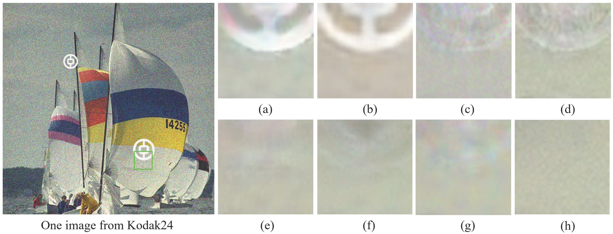
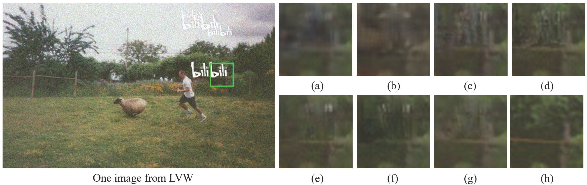

## This paper as well as  A self-supervised network for image denoising and watermark removal is conducted by Chunwei Tian, Jingyu Xiao, Bob Zhang, Wangmeng Zuo, Yudong Zhang, Tianruo Yang. This  paper is accepted by the Neural Networks 2024 (IF:8.4) and it is implemented by Pytorch. 

## This paper is reported by 52CV (https://mp.weixin.qq.com/s/5zZ61eU5oWLiPc-Aopn82w).

## Its abstract is shown as follows.

## In image watermark removal, popular methods depend on given reference non-watermark images in a supervised way. However, reference non-watermark images are difficult to obtain in the real world. At the same time, they often suffer from the influence of noise when captured by digital devices. To resolve these issues, in this paper, we present a self-supervised network for image denoising and watermark removal (SSNet). SSNet uses a parallel network in a self-supervised learning way to remove noise and watermarks. Specifically, each sub-network contains two subblocks. The upper sub-network uses the first sub-block to remove noise, according to noise-to-noise. Then, the second sub-block in the upper sub-network is used to remove watermarks, according to the distributions of watermarks. To prevent loss of important information, the lower sub-network is used to simultaneously learn noise and watermarks in a self-supervised learning way. Moreover, two sub-networks interact via attention to extract more complementary salient information. The proposed method does not depend on paired images to learn a blind denoising and watermark removal model, which is very meaningful for real applications. Also, it is more effective than the popular image watermark removal methods in public datasets. Codes can be found at https://github.com/hellloxiaotian/SSNet.

## Requirements (Pytorch)

* pytorch==1.3.1
* scikit-image==0.21.0
* opencv-python==4.5.2
* h5py==3.10.0

## DataSet

### Training datasets

#### The training dataset of the PASCAL VOV 2012 can be obtained at https://pan.baidu.com/s/1u69ygXXsQ5VRX3hCqfvnpQ (dncn)

### Test datasets

#### The training dataset of CBSD68, Kodak24, CLWD, and LVW can be obtained at https://pan.baidu.com/s/1sQ9CQgPGgjOKRZZiiQGSDw (ohfn)

## Commands

### Train

python train.py --data_path [YOUR_PATH_TO_TRAINING_DATA] --outf [YOUR_PATH_FOR_SAVING_CHECKPOINTS] --batchSize [BATCH_SIZE]

### TEST

python test.py --ckpt_dir [YOUR_PATH_TRAINED_CHECKPOINTS] --test_dir [YOUR_PATH_TO_TEST_DATA] --test_data [TEST_SET]

## 1. Network architecture of SSNet.

## 2. Average PSNR(dB) and SSIM of several methods for noise level of 15, 25, and 50 with 1, 2, and 4 watermarks on CBSD68 dataset.  

## 3. Average PSNR(dB) and SSIM of several methods for noise level of 15, 25, and 50 with 1, 2, and 4 watermarks on Kodak24 dataset.  

## 4. Average PSNR(dB) and SSIM of several methods for noise level of 15, 25, and 50 with 1, 2, and 4 watermarks on 100 images from CLWD dataset.

## 5. Average PSNR(dB) and SSIM of several methods for noise level of 15, 25, and 50 with 1, 2, and 4 watermarks on 100 images from LVW dataset.

## 6. Visual results of several methods on an image from CBSD68 for noise level of 50 and one watermark.

## 

## 7. Visual results of several methods on an image from Kodak24 for noise level of 25 and two watermarks.

## 

### 8. Visual results of several methods on an image from LVW for noise level of 15 and four watermarks.

## You can cite this paper by the following ways.

### 1. Tian C, Xiao J, Zhang B, et al. A self-supervised network for image denoising and watermark removal[J]. Neural Networks, 2024: 106218.

### 2.@article{tian2024self,
  title={A self-supervised network for image denoising and watermark removal},
  author={Tian, Chunwei and Xiao, Jingyu and Zhang, Bob and Zuo, Wangmeng and Zhang, Yudong and Lin, Chia-Wen},
  journal={Neural Networks},
  pages={106218},
  year={2024},
  publisher={Elsevier}
}
